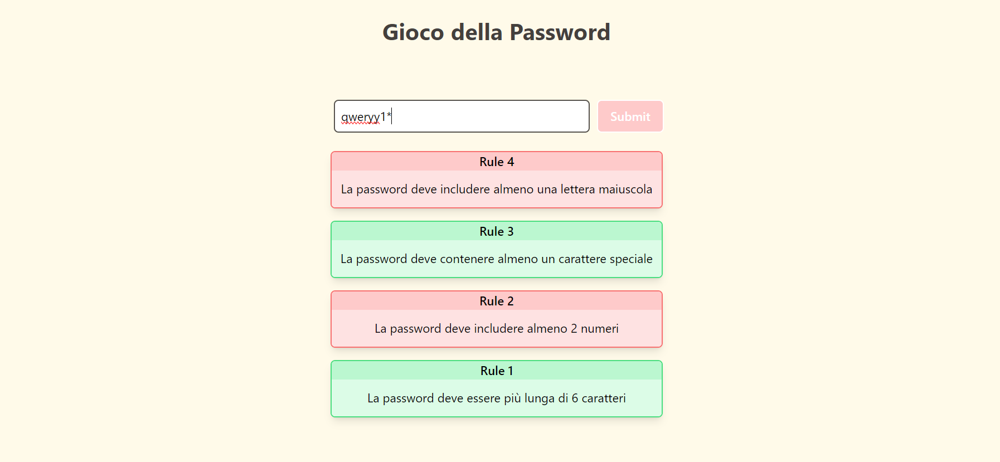

# Password Game

### About:
This project offers an endless password game where users input passwords following gradually appearing validation rules. With a total of 10 distinct password requirements, players must adapt their inputs to meet each new criterion as it arises.

### Demo:

### Technologies Used:

### Packages Used:
- [Classnames](https://www.npmjs.com/package/classnames)

### Other Links:
- [Inspired by](https://neal.fun/password-game/)

